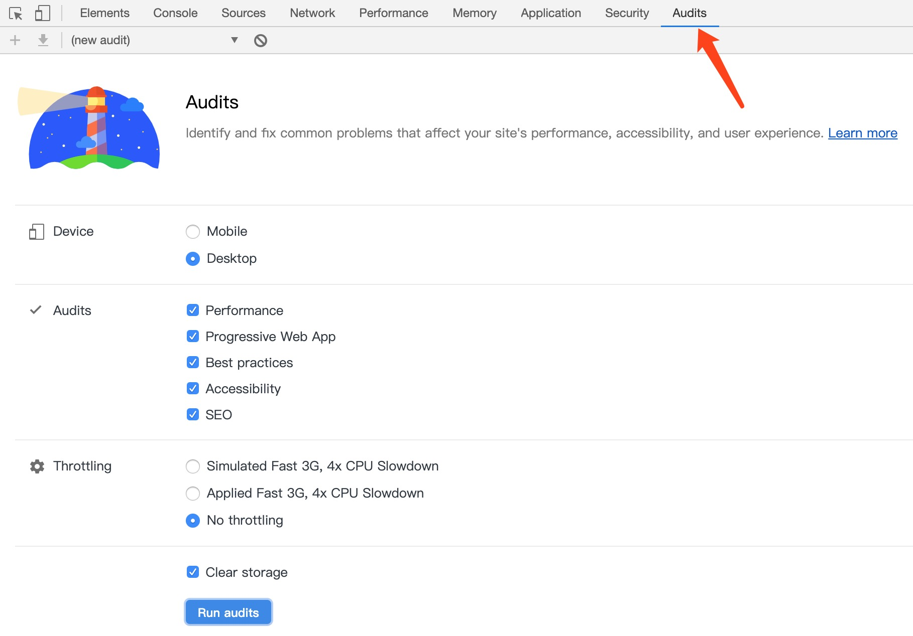

优化页面
========

页面完成上线之后，我们最好使用优化工具检查一下有哪些优化项可以调整。这样做，一方面能让我们的网站工作得更好；另一方面，也可以发现当前工作流程当中不合适的地方，进行改进。

如今 Chrome 已经整合了我们需要的工具。只要打开目标网站，启动开发者工具，然后选择“Audits”选项卡，就可以看到。

这个工具其实是 [Lighthouse](https://developers.google.com/web/tools/lighthouse/)，已经面世一段时间了。我们不仅可以在开发者工具中使用它，还可以通过 NPM 安装，在本地运行，或者集成进 CI 系统。

它的界面很简单，我们可以从多个维度对页面进行审计。首先是设备类型，可以选择移动端或者桌面端。然后是审计内容，包括性能、PWA、最佳实践、可访问性、SEO。再接着是限流，看你要不要检查在低带宽情况下，网站的表现。最后，你还可以选择是否清掉缓存，因为有些网站会设计成让用户经常使用，比如微博；有些网站可能大部分用户只会访问一次，比如我厂官网。

设置完成之后，点击“Run audits”按钮，Chrome 就会开始对页面进行审计。片刻之后，就能看到结果。

在没有特意优化的情况下，我厂官网的得分是：

1. 性能 91
2. 可访问性 68
3. 最佳实践 93
4. SEO 100
5. PWA 方面，作为企业官网，没有这方面的需求，所以略过

几个得分都还不错，“可访问性”表现比较差，这方面的确我以前做的不太好，以后还是要多多注意，让那些非标准的用户也能获得良好的网站访问体验。

其实我们还应该针对其它维度对网站进行测试，不过限于文章篇幅，我就不详细测试评价了。如果大家对质量有不同的要求，也可以将来再交流。

常见优化方式
--------

基本上，让用户感觉网站速度很快，有两种方式：

1. “真的”加快网页下载、打开速度
2. 让用户“以为”下载速度加快了

针对前者，我们可以：

1. 使用 CDN，把静态资源放在离用户更近的地方
2. 减少资源体积，压缩图片，使用新格式
3. 合并 CSS 和 JS
4. 开启 Gzip，压缩文本
5. 合并小请求，比如把小图片转换成 Base64 塞到 CSS 或者 HTML 里

Lighthouse 会针对这些项目进行检查，找出不符合要求的，给出提示。如果我们想让用户“觉得”加载的更快，可以考虑：

1. 改善首屏打开速度。
    1. 把 `<script>` 放到页面的最后，因为 `<script>` 会阻塞渲染。当然我们也可以用 `defer`，`async` 属性控制。
    2. `<head>` 里的样式也会影响首屏打开速度，浏览器会等待这部分样式加载完成后再渲染。所以我们可以把首屏样式直接用 `<style>` 标签插入 `<head>`。不过在本项目中我不打算这么做，太麻烦。
    3. 使用 Web font 时，使用 `font-display: swap` 让字体加载完成前能够先渲染
2. 改善后面的渲染速度。
    1. `` 尽量加上宽高，不要让页面自适应，这样可以减少重布局
    2. 不要用 `<script>` 往页面里写东西
    3. 模板使用 `<template>` 标签包括，避免渲染
3. 减少 JS 执行时间
    1. 把 JS 拆分，启动时只加载必须的，其它的后续在加载
    2. 大计算量的内容放到 Service worker
4. 给用户一些事情做，比如骨架屏，图片背后用渐变色渲染，用旋转的小菊花告诉用户存在 Loading，等等

除此之外，还有一些方案值得考虑，这些方案主要靠后端，所以简单提一下：

1. 改善服务器运算速度，更快的返回内容
2. 负载均衡
3. 缓存数据
4. 只返回前端请求的数据
